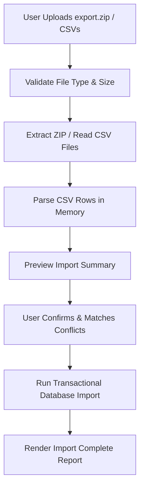

# Next Phase: Multi-User Architecture & Letterboxd Import Plan

This document outlines the design and implementation roadmap for expanding the Film Journal to support multiple public/private users and a robust, self-service Letterboxd export importer.

---

## Part 1: Multi-User Architecture

### 1. User Management & Authentication Flow
* **Registration**: 
  * Public registration endpoint: `POST /api/auth/register`.
  * Fields: `username`, `email`, `password`, `displayName`.
  * Constraints: Usernames must be alphanumeric, lowercase, and unique. Emails must be unique.
  * Security: Passwords must be hashed using a slow cryptographic KDF (e.g., Argon2id or Node's pbkdf2/scrypt with high iteration count).
* **Login & Session Management**:
  * Secure HTTP-Only, SameSite=Lax, Secure cookies containing cryptographically signed stateless tokens (session payloads containing `userId` and `exp`).
* **Password Recovery**:
  * Token-based password resets via signed, short-lived tokens (e.g. 1 hour) emailed to users (using SMTP/resend) that match against a `passwordResetToken` field on `User`.
* **Account CRUD**:
  * Profile settings update (`PATCH /api/users/profile`): change display name, bio, upload custom avatar (stored in Cloud Storage or Local Uploads).
  * Account deletion (`DELETE /api/users/profile`): drops all linked `UserMovie` and `LogEntry` records in a single transaction (using Cascade Delete on `User` relation).

### 2. Isolation & Namespacing
* **Database Isolation**:
  * All user interactions must map to a unique `userId` and query only records associated with that ID.
  * E.g., Library page queries `UserMovie` where `userId = currentUserId` and resolves global `Movie` metadata via relations.
* **Public Profiles (`/u/[username]`)**:
  * Routing structure: `src/app/u/[username]/page.tsx` for overview, `/u/[username]/diary`, `/u/[username]/stats`, etc.
  * Resolves the profile's user object from the URL username parameter.
  * Pulls the library data and logs mapped to that specific profile user, rendering them in a read-only layout matching the current journal layout.
* **Role-Based Authorization**:
  * Roles: `USER`, `ADMIN`, `OWNER`.
  * Server-side utility `requirePermission(userId, action)` checks permissions before database writes.
  * Users can only edit or delete their own `UserMovie` and `LogEntry` records. Admins/owners can manage global metadata (e.g. adding new movies, editing TMDb cached info, or custom poster defaults).

---

## Part 2: Letterboxd CSV / ZIP Importer

### 1. File Upload & Processing Pipeline

### 2. Validation & Security Guardrails
* **Type Validation**: Verify the uploaded file type is exactly `application/zip` or `text/csv`.
* **Size Validation**: Restrict uploads to a maximum of 15MB to prevent denial of service (DoS) attacks from parsing massive files.
* **Parsing Safety**: Use stream-based parsing (like `csv-parser`) to avoid reading the entire file into a single memory block, preventing memory exhaustion.

### 3. Entity Resolution & Matching Strategy
When parsing Letterboxd records, resolve the movie globally to the `Movie` table to avoid duplicate metadata storage, then link to the user's `UserMovie` profile.
1. **TMDb ID Matching**: Extract the TMDB ID if available in the CSV/Letterboxd metadata.
2. **IMDb ID Matching**: Match against `imdbId`.
3. **Letterboxd URI Matching**: Match against `letterboxdUri`.
4. **Fuzzy Name + Year Matching**: Normalize titles (remove special chars, lowercase) and match where title matches and year is ±1 year.
5. **Conflict Resolution**: If a film cannot be resolved, store it as an unresolved matching card, allowing the user to select the correct film from a search query before finishing the import.

### 4. Idempotency & Transactional Integrity
* **Idempotency**: Use a unique `sourceKey` / `dedupeKey` fingerprint (e.g., `import:letterboxd:userId:watchDay:movieId:occurrence`) to ensure that re-uploading the same CSV multiple times does not duplicate diary logs or library entries.
* **Transactional Guarantee**: Wrap the database insertions for the import in a single Prisma Transaction (`prisma.$transaction`). If any error occurs (e.g., database lock, disk full, invalid record), roll back the entire import so the user's database is never left in a corrupted or partially imported state.
* **Report Generation**: Return a JSON summary containing:
  * Number of new movies added.
  * Number of diary logs created.
  * Number of watchlist items mapped.
  * Count of duplicates ignored.
  * List of unresolved conflicts.

---

## Part 3: Migrations & Test Strategy

### 1. Schema Migration Plan
* **Prisma Migrations**: Transition from development-only `prisma db push` to production-ready migrations: `prisma migrate dev --name <migration_name>`.
* **Phased Deployments**:
  1. Add new models (`User`, `UserMovie`) and nullable relation columns.
  2. Deploy data migration scripts (like `migrate-user-data.ts`) to populate columns and relations.
  3. Change columns to non-nullable in schema and run final migration.

### 2. Testing Framework
* **Unit Testing**: Implement `jest` or `vitest` to verify:
  * Session signing and validation algorithms (`src/lib/auth.ts`).
  * CSV parsing rules and mapping logic.
  * Decoupled roulette selection.
* **Integration Testing**: Use `Playwright` to test:
  * User login and page access restrictions (visitors see read-only, owner sees actions).
  * Movie roulette spin animation and keyboard navigation.
